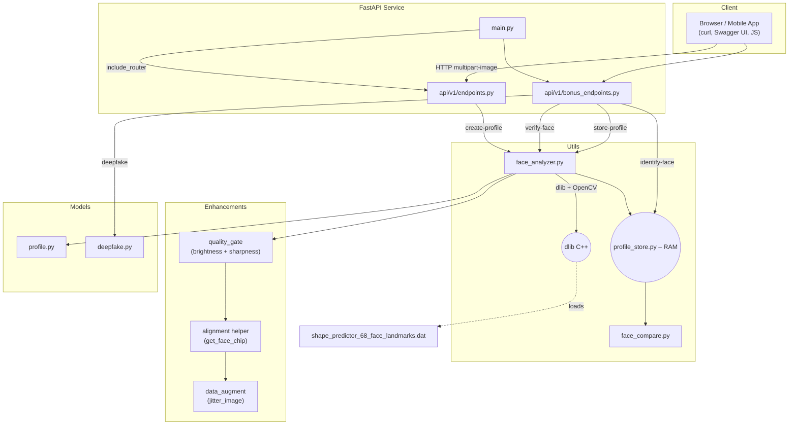

# Validia – System Design Overview



### Flow Description

1. **Client** uploads an image (multipart/form-data) to one of the REST endpoints.
2. `endpoints.py` / `bonus_endpoints.py` read the bytes and pass them to `face_analyzer.py`.
3. `face_analyzer.py` decodes the image with OpenCV, loads the pretrained dlib landmark model from disk (≈100 MB), and returns 68 landmarks + basic metrics.
4. Depending on the route:
   * The data is returned directly (`create-profile`, `verify-face`).
   * Saved into the in-memory `profile_store.py` (`store-profile`).
   * Compared against a stored reference via `face_compare.py` (`identify-face`).
   * Passed through a stub heuristic to simulate deep-fake detection (`detect-deepfake`).
5. JSON responses are serialized by Pydantic models and sent back to the client.

### Deployment Notes

* **Stateless** – Identification storage is in-memory; restart loses profiles (swap with a DB for prod).
* **CPU-only** – Dlib's HOG detector runs on CPU; OpenCV is the headless wheel.
* **Single binary dependency** – Only the .dat landmark model is required at runtime (no other external assets).

### Containerisation

The repo ships with a `Dockerfile` and `docker-compose.yml`:

* **Dockerfile** – Builds a slim Python 3.11 image, installs build essentials & CMake, compiles `dlib==20.0.0`, and downloads the 68-landmark model into `/app/models/`.  Uvicorn is launched on port 80 inside the container.
* **docker-compose.yml** – Maps host **8000 → 80** and mounts the working directory for live-reload during development.

Typical workflow:

```bash
# first build (≈ 5–10 min – compiles dlib)
docker compose build
# run & watch logs
docker compose up            # http://localhost:8000/docs
```

CI on GitHub reuses the same Dockerfile to ensure parity between local and remote environments.

### Scaling Ideas

* Add Redis or PostgreSQL for persistent profile storage.
* Off-load compute-heavy detection models to GPU micro-service.
* Place Uvicorn behind an ASGI server like `uvicorn --workers 4` or `gunicorn -k uvicorn.workers.UvicornWorker`. 